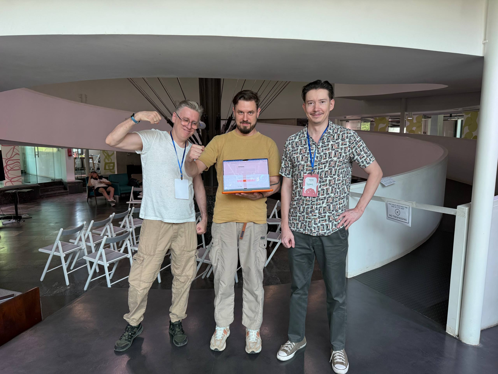
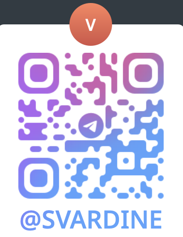
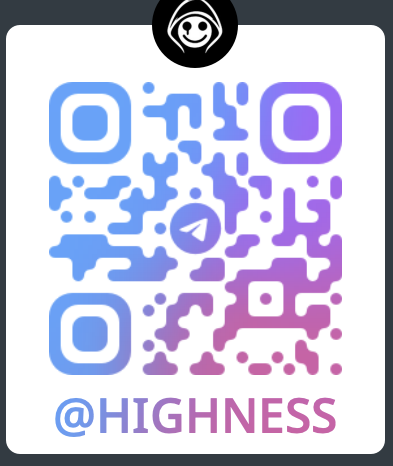
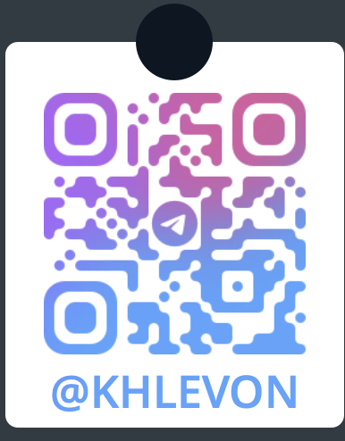
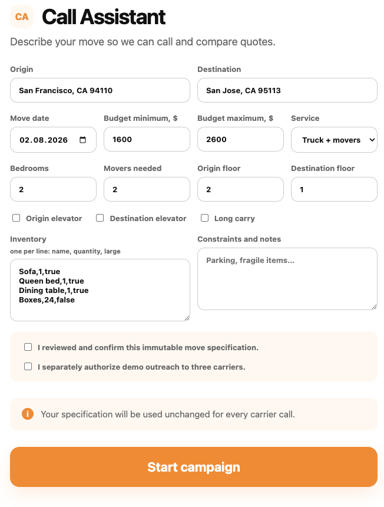
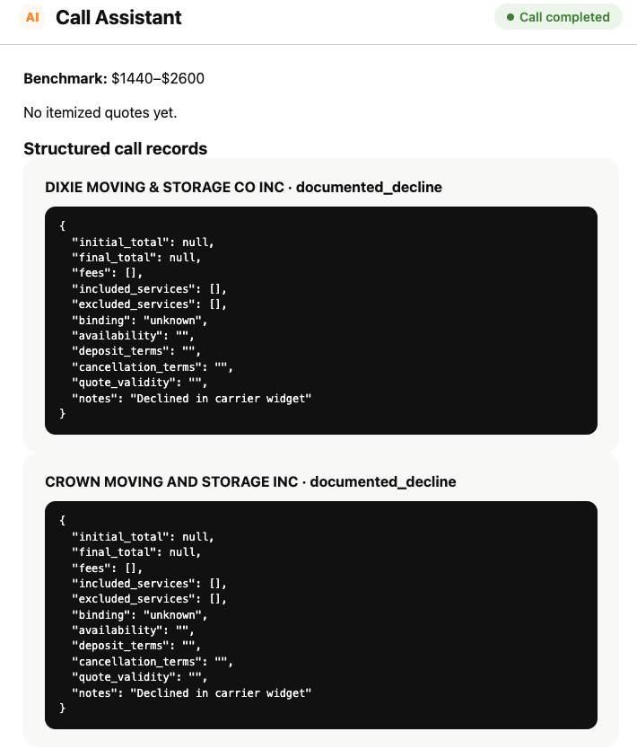
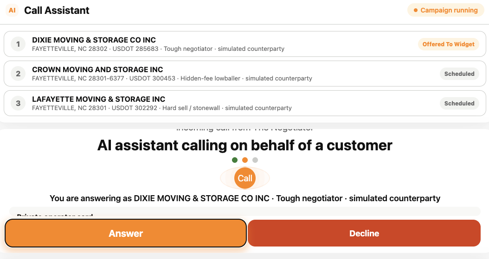

# Let's voice agents works for you

 

**LLM Plumbers · The Negotiator**

For one identical 45-mile move, Daniel saw prices from <b>$1,158</b> to <b>$6,506</b>. 
The only way to find a fair price is to call 5–8 movers, repeat the same story, compare hidden fees, and negotiate.

<!--
0:00–0:20 — Open with Daniel, not the product. “The price of a move should not depend on who has the time to make eight calls.”
-->

---
layout: center
class: deck-white
---

## The Problem

Moving is hard. You need to call many companies, explain the same move again and again, and compare their prices.

<ul class="simple-list">
  <li>Many phone calls</li>
  <li>The same details again and again</li>
  <li>Extra fees that are hard to see</li>
  <li>Prices that are hard to compare</li>
</ul>

## Solution: Burn tokens instead of spending your time.

An AI agent can make these calls, collect the important details, and ask for a better price. You can spend your time on packing and your new home.

<!--
0:20–0:30 — One beat of humor. Do not overexplain tokens. Pivot immediately to what agents do better.
-->

---
layout: default
class: deck-white
---

The Negotiator

# One confirmed job. Multiple honest calls. One decision.

  
<b>1. Tell us once</b> Voice interview or document / form submission creates a single, confirmed move spec.

  
<b>2. Call for you</b> The agent reaches movers with the exact same facts and explicit consent.

  
<b>3. Negotiate honestly</b> It uses only a real benchmark or a verified competing quote.

  
<b>4. Pick with proof</b> Ranked prices, itemized terms, red flags, transcripts, and recordings.

<b>We help people facing phone-priced purchases get a fair deal</b> by sending voice agents to call, compare, and negotiate for them.

<!--
0:30–0:45 — Solution overview. The system is not “a chatbot that recommends”; it completes the tedious loop.
-->

---
layout: two-cols
class: deck-white
---

# Our Team: LLM Plumbers

Three people who were tired of plumbing opaque workflows by hand — so we built agents that pick up the phone.

<b>Built during HackNation</b> Product, voice-agent orchestration, backend, and demo — one team, one weekend.

<b>LLM Plumbers</b> From left to right: Slach · Dmitry · Ramil

  <a href="https://github.com/Slach" target="_blank">github.com/Slach</a> 
  <a href="https://github.com/tjvjk" target="_blank">github.com/tjvjk</a> 
  <a href="https://github.com/ramilmustafin" target="_blank">github.com/ramilmustafin</a>

::right::

<!--
0:45–0:55 — Name the team quickly. The image crop intentionally centers the three faces and the laptop.
-->

---
layout: default
class: deck-white
---

Recorded demo · fallback for the live flow

# The Negotiator in action

<video src="/video/demo.mp4" controls preload="metadata" poster="" aria-label="The Negotiator demo video"></video>

<!--
1:35–2:27 — Play the video. It is intentionally embedded from presentation/public/video/demo.mp4 so the deck remains self-contained after build.
-->

---
layout: center
class: deck-white
---

# Спасибо mentors!

  
<b>Vardineh</b>

  
<b>Wolf</b>

  
<b>Levon</b>

<!--
2:55–3:00 — Thank mentors briefly. Then advance to the final QR slide for questions/networking.
-->

---
layout: end
class: deck-white
---

# Try The Negotiator

  
<b style="display:block; margin-top:.35rem; white-space:nowrap!important">Live product</b><a href="http://calls.feedfinch.com" target="_blank" style="display:block!important; white-space:nowrap!important">calls.feedfinch.com</a>

  
<b style="display:block; margin-top:.35rem; white-space:nowrap!important">Source code</b><a href="https://github.com/tjvjk/hack-nation-vas3k" target="_blank" style="display:block!important; white-space:nowrap!important">github.com/tjvjk/hack-nation-vas3k</a>

LLM Plumbers · The Negotiator · HackNation / ElevenLabs

---
layout: default
class: deck-white
---

Live system architecture

# One voice workflow. One control plane.

  
<b>ElevenLabs Agents</b> Voice reasoning Conversation runtime

  
↔

  
<b>Orchestrator widget</b> Browser voice session Carrier demo console

  
↔

  
<b>Orchestrator backend</b> REST state · MCP tools Signed URLs · webhooks

  
↙

  
↘

  
<b>Google Maps API</b> Origin / destination → Place IDs

  
<b>MovingBuddha API</b> Market benchmark range

<b>Data stays server-side:</b> API keys and ElevenLabs credentials never enter the browser.

---
layout: default
class: deck-white
clicks: 3
---

Product walkthrough · click to advance

# From intake to a live call

  

  

  

  01 · intake
  02 · extraction
  03 · live call

